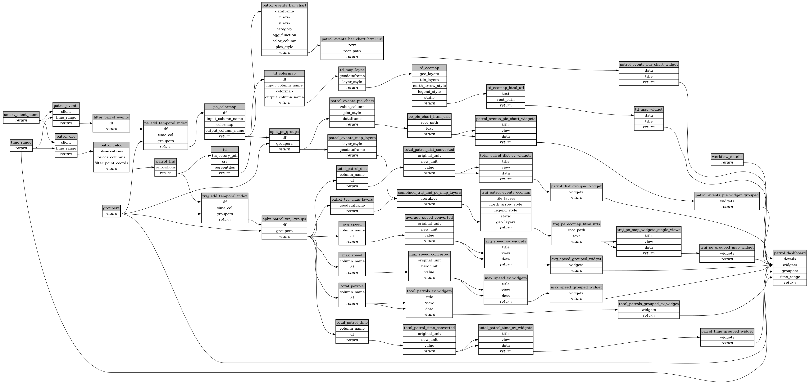

```
# AUTOGENERATED BY ECOSCOPE-WORKFLOWS; see fingerprint in README.md for details

```

```yaml
# fingerprint:
artifacts_sha256_basic: b049ebd2e8ff9fe49aa96714c269f841a035396d9509d7d86300ab63cfa534ff
artifacts_sha256_strict: c304ed92f58895c2c793abed580ddc27c1613e7a0adb1b083073fd82787f83b0
installed_requirements:
- channel: https://repo.prefix.dev/ecoscope-workflows/
  name: ecoscope-workflows-core
  version: {version: ==0.0.34}
- channel: https://repo.prefix.dev/ecoscope-workflows/
  name: ecoscope-workflows-ext-ecoscope
  version: {version: ==0.0.34}
params_sha256: 2bf1aae3a1fc586e66ee6ce409e52ab057b3a07848a410f71c4323d69441ecd5
spec_sha256: 5f9c76124c670494700c1248af1f863a51bef84ddfe1bd02157f05b2030edd7e

```

# ecoscope-workflows-smart-patrols-workflow


