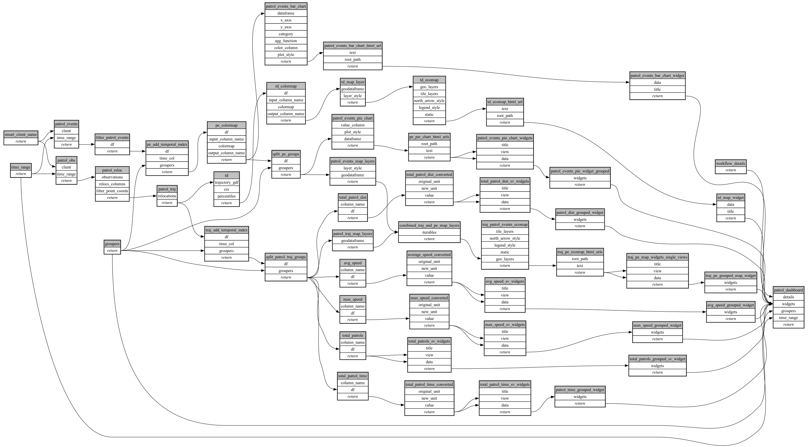

```
# AUTOGENERATED BY ECOSCOPE-WORKFLOWS; see fingerprint in README.md for details

```

```yaml
# fingerprint:
artifacts_sha256_basic: 5e2b2ecf326ae194f4ccd331beb0fffe81b317d89a1e43d3392477950bdb5bbb
artifacts_sha256_strict: 917d99e8c9800b6a66a841431e084e5fe316c1b44fb3dba3071b72df22dcf0e5
installed_requirements:
- channel: file:///tmp/ecoscope-workflows/release/artifacts/
  name: ecoscope-workflows-core
  version: {version: ==0.0.67}
- channel: file:///tmp/ecoscope-workflows/release/artifacts/
  name: ecoscope-workflows-ext-ecoscope
  version: {version: ==0.0.67}
params_sha256: 5fc1fa5e5fa78139e9b039065d86814c9cae5031df5d69aaa4ccf7deaae8efb3
spec_sha256: b25b1552b04d8aefdb9d6b4b881c9decfe083aa52e7355aba271c5b6d3433f5e

```

# ecoscope-workflows-smart-patrols-workflow


